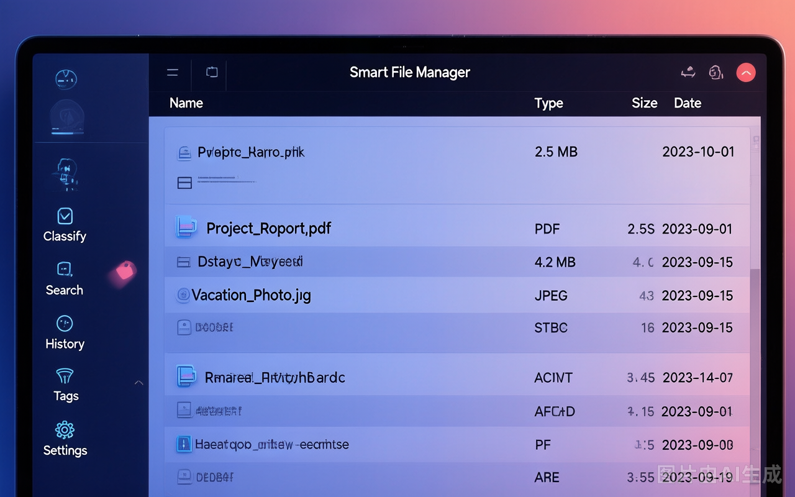
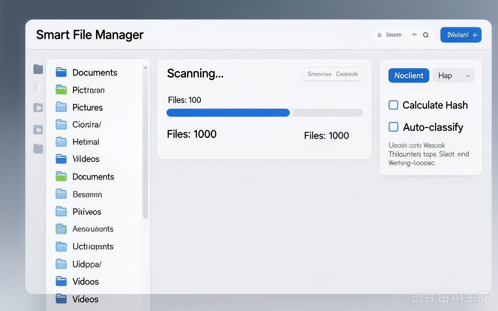
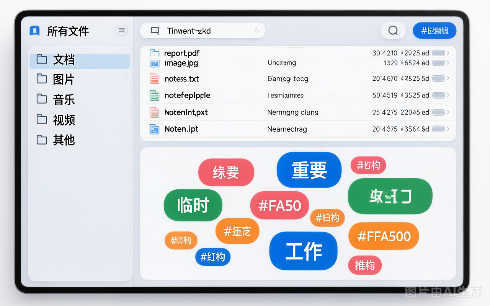

<p align="center">
  <h1 align="center">FileNest</h1>
  <p align="center">本地文件扫描、分类、搜索、标签管理工具 — SQLite 嵌入式数据库，开箱即用</p>
</p>

<p align="center">
  
  
  
  
  
</p>

---

> **注意**：截图可能与当前版本略有差异。当前界面支持深色与浅色主题，并持续以实际功能为准更新。

## 截图预览

<p align="center">
  
  <br>
  <em>主界面 - 仪表盘 / 统计卡片 / 深色主题</em>
</p>

<p align="center">
  
  <br>
  <em>扫描管理 - 目录选择 / 进度显示 / 扫描选项</em>
</p>

<p align="center">
  
  <br>
  <em>分类与标签 - 分类树 / 标签云 / 文件关联</em>
</p>

---

## 目录

- [功能概述](#功能概述)
- [技术栈](#技术栈)
- [安装](#安装)
- [界面设计](#界面设计)
- [使用指南](#使用指南)
  - [仪表盘](#仪表盘)
  - [扫描管理](#扫描管理)
  - [分类管理](#分类管理)
  - [文件搜索](#文件搜索)
  - [AI 助手](#ai-助手)
  - [操作历史](#操作历史)
  - [回收区](#回收区)
  - [重复文件](#重复文件)
  - [标签管理](#标签管理)
  - [安全清理中心](#安全清理中心)
  - [系统设置](#系统设置)
- [项目结构](#项目结构)
- [快捷键](#快捷键)
- [常见问题](#常见问题)
- [许可](#许可)

---

## 功能概述

### 核心功能
- **文件扫描** — 递归扫描目录，增量扫描跳过已处理文件，支持哈希计算
- **智能分类** — 按文件类型、修改日期、关键词、手动标记四维度自动归类
- **文件搜索** — 文件名 FTS5 与本地正文索引双检索，支持类型/大小/日期/重复状态筛选、自然语言解读、搜索历史、智能集合与 CSV 导出
- **AI 助手** — 多轮对话式文件搜索与分析，支持受限工具调用（文件搜索、已索引正文检索、文件读取、联网搜索）与多模型切换
- **回收区管理** — 应用内回收区（.trash/），支持恢复、永久删除、清空回收区
- **标签管理** — 独立标签系统，标签云可视化，自由创建和批量标记
- **操作撤销** — 自动记录操作历史，单条/批量撤销，Ctrl+Z 全局快捷键
- **自动整理规则** — 可视化规则管理界面，增删改、启停、优先级排序与命中测试
- **安全清理中心** — 聚合重复/临时/空/长期未用/超大文件建议，一键移入回收区（可撤销），支持排除目录与误报反馈

### v2.0 新增功能
- **📊 智能仪表盘** — 4 统计卡片（总文件数/已分类/标签数/存储用量）+ AI 文件洞察面板 + 类型分布饼图 + 最近活动 + 文件增长趋势 + 快捷操作面板
- **🤖 AI 全能助手** — 多轮对话 + 受限工具调用（文件/正文搜索、联网搜索、文件读取），多模型配置，会话历史管理
- **🔁 重复文件可视化** — 分组展示重复文件，支持单副本删除、保留最新副本和安全回收
- **📁 文件预览面板** — 分类管理中支持图片缩略图预览、代码语法高亮、元数据展示、快捷操作按钮
- **👀 文件变化监控** — 基于 watchdog 实时监控已扫描目录的文件新增/修改/删除
- **⚡ 数据缓存预加载** — 启动后延迟后台加载分类数据，不阻塞 UI 渲染

### v2.1 更新亮点
- **📝 本地正文索引** — 可索引文本、PDF 与 DOCX；正文检索不上传文件内容，命中结果展示上下文片段与来源路径
- **🔖 智能集合** — 保存常用筛选条件，形成可重复使用的虚拟文件视图，不移动真实文件
- **🧭 任务与索引健康管理** — 扫描、后处理、正文索引和清理分析可在任务中心查看；索引检查可发现失效路径和孤立正文索引，并在确认后安全修复
- **📊 空间与重复文件优化** — 仪表盘展示目录占用排行；重复文件可保留最新副本或将单个副本移入回收区
- **🛡️ 操作安全增强** — 批量重命名/移动提供预览，回收区恢复冲突支持自动重命名，AI 不具备任意代码执行权限

### v2.4 更新亮点（批次 1-3 合并发布）
- **⚡ 增量索引自动落库** — 文件新增/修改/移动/删除自动更新索引，事件风暴合并、单文件失败重试，无需手动重扫
- **🔍 内容索引指纹增量** — 正文索引按文件修改指纹（大小+时间）增量更新，未变化的文件不重复提取
- **🧠 高级搜索语法** — 自然语言解析全量容错（特殊字符不崩溃），结构化条件回显，内置语法提示面板
- **🗂️ 智能集合入库** — 搜索条件保存为命名集合持久化到数据库，随时一键复用
- **📐 操作计划模型** — 批量移动/删除/重命名先生成计划（影响范围/冲突/不可逆项/释放空间），过期自动重校验
- **🔬 多阶段重复检测** — 大小 → 快速哈希 → 完整哈希三级确认，中断可续算，未完整校验不误判重复
- **🧹 安全清理中心** — 聚合重复/临时/空/长期未用/超大文件建议，一键移入回收区（可撤销），支持排除目录与误报反馈
- **🖥️ 清理中心对话框** — 分类 Tab 浏览、全选、逐项清理、排除目录、误报反馈、排除管理，单例复用 + 数据指纹缓存秒开
- **🛠️ 未捕获异常记录** — 程序崩溃自动写入日志并弹窗提示，问题可追溯

### 体验优化
- **双主题** — 深空暗蓝/浅色主题一键切换
- **操作反馈** — 顶部 Toast 通知 + 底部状态栏双重反馈
- **服务端分页** — 所有列表页均支持分页，大数据量下流畅浏览
- **首次引导** — 首次启动展示功能引导对话框

## 界面设计

当前 UI 基于 Ardot 设计图重构，配色体系：

| 用途 | 颜色值 | 说明 |
|------|--------|------|
| 页面背景 | `#0f0f1a` | 深空暗蓝 |
| 卡片背景 | `#1a1a2e` | 暗蓝灰，圆角 12px |
| 强调色 | `#3b82f6` | 蓝色（主按钮、选中态） |
| 成功色 | `#10b981` | 绿色 |
| 警告色 | `#f59e0b` | 橙色 |
| 危险色 | `#ef4444` | 红色 |
| 文字主色 | `#e8e8ef` | 近白 |
| 文字副色 | `#a0a0b0` / `#6b6b7b` | 灰色 |

导航栏为 52px 宽的纯图标栏（emoji 图标 + Tooltip），鼠标悬停显示功能名称。

## 技术栈

| 层 | 技术 |
|----|------|
| 前端 | PyQt6 |
| 数据库 | SQLite（Python 标准库内置，零配置，WAL 模式） |
| 搜索 | SQLite FTS5（倒排索引全文搜索） |
| AI | OpenAI 兼容 API（DeepSeek/通义千问/Moonshot/智谱/硅基流动等） |
| 哈希去重 | SHA256 |
| 回收区 | 应用本地 .trash/（shutil） |
| 元数据提取 | Pillow, PyPDF2, PyMuPDF, python-docx, python-pptx |
| 文件监控 | watchdog |
| 代码预览 | pygments |
| 联网搜索 | httpx + SearXNG / Bocha API |
| 环境变量 | python-dotenv |

## 安装

### 前置要求

- Python 3.9 或更高版本
- Windows / macOS / Linux 均可运行

### 依赖说明

| 包 | 用途 |
|----|------|
| PyQt6 | GUI 框架 |
| Pillow | 图片处理、EXIF 提取 |
| PyPDF2 + PyMuPDF | PDF 属性提取 |
| python-docx | Word 文档处理 |
| python-pptx | PowerPoint 文档处理 |
| watchdog | 文件系统变化实时监控 |
| pygments | 代码文件语法高亮预览 |
| httpx | AI 联网搜索 HTTP 客户端 |
| python-dotenv | .env 环境变量加载 |

数据库使用 Python 标准库内置的 `sqlite3`，无需安装任何外部数据库。

### 步骤

```bash
# 1. 克隆仓库
git clone https://github.com/1371239533jkl/FileNest.git
cd FileNest

# 2. 安装依赖
pip install -r requirements.txt

# 3. 启动（首次自动创建 SQLite 数据库和全部数据表）
python main.py
```

> 首次启动自动在项目根目录创建 `smart_file_manager.db`（WAL 模式），无需任何手动配置。

### 配置说明

数据库零配置。AI 功能可选配置 API Key：

```ini
# .env（可选）
SMART_FM_AI_KEY=你的API密钥
# 博查联网搜索（可选）
BOCHA_API_KEY=你的博查API密钥
```

---

## 使用指南

应用启动后显示左侧 52px 纯图标导航栏（鼠标悬停显示名称）和右侧内容面板，共 10 个功能页面。

### 界面布局

```
┌──────────────────────────────────────────────────┐
│  FileNest                       [🌙]     v2.4.0     │
├───┬──────────────────────────────────────────────┤
│ 📊│                                              │
│ 📂│                                              │
│ 📁│                                              │
│ 🔍│              主内容面板                        │
│ 🤖│                                              │
│ 📋│                                              │
│ 🔄│                                              │
│ 🔃│                                              │
│ 🏷│                                              │
│ ⚙│                                              │
├───┴──────────────────────────────────────────────┤
│  就绪                                             │
└──────────────────────────────────────────────────┘
```

---

### 仪表盘

可视化展示文件统计概况，四行卡片布局。

**统计卡片（第一行）**：总文件数 / 已分类 / 标签数 / 存储用量（带图标和彩色子标题）

**中间行（三列）**：
- AI 文件洞察面板（需配置 AI Key）
- 文件类型分布饼图
- 最近活动列表

**底部行**：
- 文件增长趋势图（近 12 个月扫描文件数折线图）
- 快捷操作面板（开始新扫描 / 查找重复文件 / AI 文件分析）

> 所有图表使用纯 QPainter 绘制，无外部图表库依赖。点击"刷新"按钮重新加载数据。

---

### 扫描管理

扫描指定目录，将文件信息录入 SQLite 数据库。

| 操作 | 说明 |
|------|------|
| 选择目录 → **开始扫描** | 执行扫描，将文件信息存入数据库 |
| **计算文件哈希** | 勾选后为去重做准备（读取文件内容计算，大文件较慢） |
| **自动分类 / 提取元数据** | 勾选后扫描完成自动执行后处理 |
| **建立正文索引** | 勾选后扫描完成自动索引文本/PDF/DOCX 内容 |
| **清理中心** | 打开安全清理中心（聚合建议 + 一键移入回收区） |
| **任务中心** | 查看后台扫描/索引/分析任务进度 |
| **索引检查** | 发现失效路径与孤立正文索引，确认后安全修复 |
| **取消** | 中断正在进行的扫描任务 |
| 目录列表 → **删除** | 移除扫描配置（仅删除记录，不影响文件） |

> 对已扫描过的目录再次执行扫描时，只处理新增和修改的文件。
> 启用文件监控后，文件变化会自动增量更新索引（无需手动重扫），并提示同步结果。

---

### 分类管理

左侧分类导航树，右侧显示对应文件。**支持文件预览面板**。

**分类维度**：
- 按类型：图片 / 文档 / 视频 / 音频 / 压缩包 / 代码 / 可执行文件 / 字体
- 按日期：年-月
- 按关键词：工作 / 学习 / 生活 / 项目

**文件列表右键菜单**：

| 操作 | 功能 |
|------|------|
| 打开文件 | 系统默认程序打开 |
| 打开所在文件夹 | 资源管理器定位 |
| 复制路径 / 复制文件名 | 复制到剪贴板 |
| 重命名 | 修改硬盘文件名（需二次确认） |
| 标记删除 | 送回收站 + 数据库标记 |
| 永久删除 | 彻底从硬盘删除，不可撤销（双重确认） |
| AI 描述文件 | AI 生成文件内容摘要 |

顶部工具栏提供 **整理规则管理**：可视化编辑分类规则（关键词/扩展名/正则三类），支持新增、编辑、删除、启停、优先级排序和按文件名测试命中。

---

### 重复文件

可视化展示重复文件组，数据来自**多阶段检测**（大小 → 快速哈希 → 完整哈希三级确认），支持逐副本删除与保留最新副本。

| 操作 | 说明 |
|------|------|
| 点击重复组 | 查看该组所有文件详情 |
| **🔎 多阶段重新检测** | 执行三级确认检测（大小→快速哈希→完整哈希），中断可续算 |
| **删除此副本** | 删除单个副本文件（需确认） |
| **保留最新副本** | 按修改时间保留最新文件，其余副本移入回收区 |
| **AI 智能选择** | AI 分析组内文件，建议保留哪个副本 |
| 分页浏览 | 每页 50 个重复组 |

> 未运行多阶段检测时列表为空；检测结果与清理中心的重复文件数据源一致。

---

### 文件搜索

文件名 FTS5 搜索 + 本地正文检索 + 多条件组合检索。

| 条件 | 说明 |
|------|------|
| 文件名 | FTS5 前缀搜索（`keyword*`），按相关性 rank 排序 |
| 扩展名 | 按文件扩展名精确筛选 |
| 类型 | 下拉选择文件分类 |
| 大小范围 | 最小值(KB) / 最大值(MB)，填 0 表示不限制 |
| 重复文件 | 全部 / 仅显示重复 / 仅显示不重复 |
| 修改时间 | 勾选后启用日期范围筛选 |
| 搜索正文 | 在已建立的文本、PDF、DOCX 本地内容索引中查找并显示命中片段 |

结果分页浏览，每页 100 条。右键菜单同分类管理。

> 支持自然语言解读（如"近一年的文档"、"大于100MB的图片"），由规则引擎解析，特殊字符不会导致解析错误，解析失败会提示查看语法示例（❓ 语法按钮）。常用条件可保存为智能集合（入库持久化）；点击 **构建正文索引** 后可启用正文搜索。

---

### AI 助手

多轮对话式 AI 助手，支持工具自动调用。

| 工具 | 说明 |
|------|------|
| 📂 文件搜索 | LLM 自主解析自然语言意图，调用 FTS5 搜索文件 |
| 📝 正文检索（含来源） | 查询已索引文档正文，返回文件路径和命中摘录，供回答引用 |
| 🌐 联网搜索 | 获取最新技术文档和网络信息 |
| 📄 读取文件 | 读取并分析本地文件内容 |

> AI 工具不提供任意 Python 或 Shell 代码执行；本地文件读取受已配置扫描目录范围限制。

模型配置在 系统设置 → AI 模型 中管理，支持自定义 API 端点、多模型模板（DeepSeek/通义千问/Moonshot/智谱/OpenAI）和连接测试。

---

### 操作历史

自动记录所有文件操作，支持撤销。

| 方式 | 说明 |
|------|------|
| 单条撤销 | 点击操作行末的 **撤销** 按钮 |
| 批量撤销 | 多选操作记录后点击底部按钮 |
| Ctrl+Z | 全局快捷键 |

---

### 回收区

管理已删除的文件。文件删除后先进入应用回收区（`.trash/`），可恢复或永久清除。

| 操作 | 说明 |
|------|------|
| **恢复** | 将文件恢复到原始路径 |
| **永久删除** | 彻底删除，不可恢复 |
| **清空回收区** | 批量永久删除 |
| 分页浏览 | 每页 100 条 |

---

### 标签管理

独立标签系统，标签可与文件关联但独立存在。

| 操作 | 说明 |
|------|------|
| **新建标签** | 创建独立标签 |
| 标签云 → 点击 | 筛选该标签关联的文件 |
| **打标签** | 选中文件后添加（支持多标签） |
| **移除标签** | 从选中文件中移除 |
| **删除标签** | 删除标签及其所有关联 |

---

### 安全清理中心

从扫描管理页的 **清理中心** 按钮打开，聚合五类清理建议：重复文件、临时/缓存、空文件、长期未用、超大文件。

| 操作 | 说明 |
|------|------|
| 分类 Tab | 按类别浏览建议，每项显示原因说明 |
| **全选当前页** | 选中当前分类页全部建议 |
| **🗑 移入回收区** | 将选中文件移入回收区（可撤销），行内按钮可逐项清理 |
| **⛔ 排除目录** | 将选中文件所在目录加入排除，之后不再建议 |
| **🙅 误报反馈** | 将选中文件标记为误报，之后不再建议 |
| **排除管理** | 查看/清空排除目录列表 |
| **🔄 刷新** | 数据变化后手动重新分析 |

> 所有清理默认移入回收区（可撤销），不物理删除。对话框单例复用 + 数据指纹缓存，打开秒开。

---

### 系统设置

左侧分类切换，右侧显示配置项。

| 分类 | 配置项 |
|------|--------|
| 通用设置 | 日志级别、数据库信息（SQLite 文件路径/大小/WAL 模式） |
| 扫描设置 | 递归、包含隐藏文件、哈希算法、大文件跳过阈值 |
| 重命名模板 | 自定义命名格式，实时预览 |
| 去重策略 | 保留最新/最旧/最短路径/手动选择 |
| AI 模型 | 自定义 API 端点、模型模板、连接测试 |

---

## 项目结构

```
FileNest/
├── main.py                   # 应用入口（延迟预加载，SQLite 零配置）
├── config.py                 # 全局配置（DB_PATH / 文件类型 / AI / 规则）
├── requirements.txt          # 10 个 pip 依赖
├── README.md                 # 项目文档
├── USER_GUIDE.md             # 用户操作指南
├── .env                      # API Key 配置（gitignored）
├── .env.example              # 环境变量模板
├── init_database.sql         # [遗留] MySQL 建表脚本（已不再使用，SQLite DDL 内置于 db_manager.py）
├── smart_file_manager.db     # [运行时] SQLite 数据库文件（WAL 模式，gitignored）
├── core/                     # 核心业务逻辑
│   ├── __init__.py
│   ├── file_scanner.py       # 文件扫描（增量/哈希/ETA）
│   ├── file_classifier.py    # 四维智能分类
│   ├── file_manager.py       # 文件操作（重命名/移动/删除/恢复）
│   ├── dedup_manager.py      # 去重管理（SHA256 分组/策略去重）
│   ├── metadata_extractor.py # 元数据提取（EXIF/PDF/视频）
│   ├── operation_history.py  # 操作历史与撤销
│   ├── tag_manager.py        # 标签管理
│   ├── file_watcher.py       # 文件变化监控（watchdog + 自动增量落库）
│   ├── index_updater.py      # 增量索引落库（事件合并/落库/失败重试）
│   ├── data_cache.py         # 全局数据缓存（延迟预加载）
│   ├── batch_classifier.py   # 批量分类线程
│   ├── rule_engine.py        # 规则引擎（NL 搜索解析/标签推荐/清理建议）
│   ├── multistage_dedup.py   # 多阶段重复检测（大小→快速哈希→完整哈希）
│   ├── cleanup_center.py     # 安全清理中心（聚合建议/排除/误报/回收区执行）
│   ├── operation_plan.py     # 操作计划模型（影响范围/冲突/过期校验）
│   ├── ai_layer.py           # AI 抽象层（多后端/场景路由）
│   ├── ai_backends.py        # AI 后端（OpenAI 兼容接口）
│   ├── ai_chat.py            # 多轮对话管理 + 工具循环
│   ├── ai_tools.py           # 受限 AI 工具（文件/正文/联网搜索、文件读取）
│   ├── ai_prompts.py         # 场景化 Prompt 模板
│   ├── ai_model_config.py    # 多模型配置管理器
│   ├── file_reader.py        # 文件内容读取器
│   ├── content_indexer.py    # 本地正文索引（文本/PDF/DOCX，指纹增量）
│   ├── task_manager.py       # 后台任务状态与取消入口
│   └── index_health.py       # 索引一致性检查与保守修复
├── ui/                       # 界面层（PyQt6）
│   ├── main_window.py        # 主窗口（图标侧边导航 + 10 标签页）
│   ├── dashboard_tab.py      # 仪表盘（统计卡片/AI洞察/饼图/活动/趋势/快捷操作）
│   ├── scan_tab.py           # 扫描管理
│   ├── classify_tab.py       # 分类管理（树形导航/文件列表/预览面板）
│   ├── search_tab.py         # 文件搜索（FTS5多条件/NL解读/分页/CSV导出）
│   ├── ai_chat_page.py       # AI 助手（多轮对话/工具卡片/流式输出）
│   ├── ai_insight_panel.py   # AI 洞察面板
│   ├── ai_settings_dialog.py # AI 模型配置对话框
│   ├── ai_file_actions.py    # AI 文件操作集成
│   ├── history_tab.py        # 操作历史
│   ├── recycle_bin_tab.py    # 回收区
│   ├── duplicates_tab.py     # 重复文件（多阶段检测结果/保留策略/AI选择）
│   ├── rule_manager_dialog.py# 整理规则管理对话框
│   ├── cleanup_center_dialog.py # 安全清理中心对话框
│   ├── tags_tab.py           # 标签管理（标签云/分页）
│   ├── settings_tab.py       # 系统设置
│   ├── chart_widgets.py      # 图表组件（StatCard/Pie/Bar/TrendChart）
│   ├── empty_state.py        # 空状态引导
│   ├── task_center.py        # 后台任务中心对话框
│   ├── onboarding.py         # 首次启动引导
│   ├── styles.py             # 双主题 QSS（深空暗蓝/浅色）
│   ├── theme_manager.py      # 主题管理器
│   └── toast.py              # Toast 通知
├── database/                 # 数据访问层
│   ├── __init__.py
│   ├── db_manager.py         # SQLite 连接管理（WAL模式/线程安全/FTS5）
│   └── models.py             # DAO 层（文件/标签/集合/规则/历史等，FTS5/分页/统计）
├── utils/                    # 工具函数
│   ├── __init__.py
│   ├── logger.py             # 日志（RotatingFileHandler）
│   ├── date_utils.py         # 日期处理
│   └── display_utils.py      # 格式化（大小/路径/图标/颜色/字体）
├── tests/                    # 测试（10 个测试文件）
│   ├── conftest.py           # Pytest fixtures
│   ├── run_all_tests.py      # 综合测试入口
│   ├── test_sqlite_migration.py  # SQLite 迁移验证
│   └── test_*.py             # 各模块单元测试
├── scripts/
│   └── clear_all_data.py     # 一键清空数据
├── migrations/               # 数据库迁移（遗留脚本）
└── docs/                     # 截图与架构文档
    ├── screenshot_main.png
    ├── screenshot_scan.png
    ├── screenshot_tags.png
    └── AI_ARCHITECTURE.md
```

---

## 快捷键

| 快捷键 | 功能 |
|--------|------|
| `Ctrl+F` | 切换到文件搜索并聚焦搜索框 |
| `Ctrl+Shift+F` | 切换到 AI 助手 |
| `Ctrl+Shift+P` | 打开命令面板 |
| `Ctrl+Z` | 执行当前页面的撤销操作 |
| `Ctrl+R` / `F5` | 刷新当前页面 |
| `Delete` | 删除当前页面选中项 |
| `F2` | 重命名选中文件 |

---

## 常见问题

**数据库在哪？**
项目根目录下的 `smart_file_manager.db`，SQLite 嵌入式数据库，无需外部服务。

**扫描大目录速度慢？**
取消勾选"计算文件哈希"可显著提升速度。也可在设置中降低哈希计算的文件大小阈值（默认 500MB 上限）。

**撤销操作失败？**
文件可能已被外部移动或删除，或原路径被其他文件占用。

**AI 功能不工作？**
确认在 `.env` 中配置了 `SMART_FM_AI_KEY`，并在系统设置 → AI 模型中添加了模型配置。也可在设置页点击"连接测试"验证。

**日志文件在哪？**
位于 `logs/app.log`，单文件最大 10MB，保留最近 5 个备份。

**程序崩溃/报错怎么办？**
未捕获异常会自动写入 `logs/app.log`（含完整堆栈）并弹窗提示。反馈问题时请附上日志末尾的 ERROR 片段，便于快速定位。

---

## 许可

本项目基于 MIT 许可证开源。详见 [LICENSE](LICENSE) 文件。
